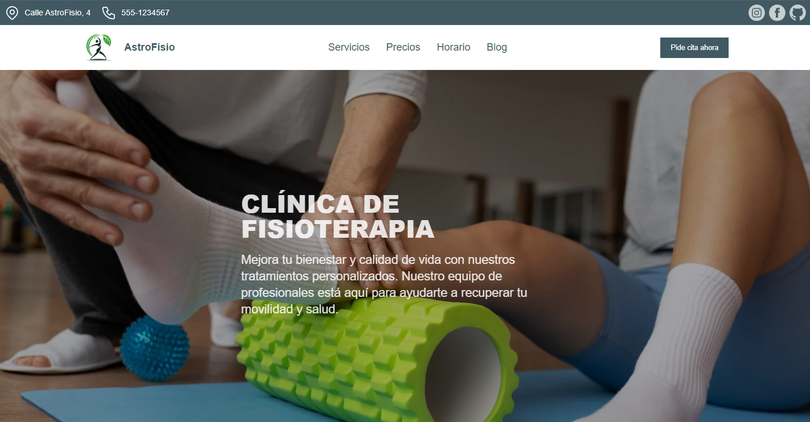

# Astro phisiotherapy theme

## Description

Website developed with astro and tailwind for a physiotherapy clinic.

## ⭐ Getting Started

1. Clone the repository:

```bash
git@github.com:javiermartins/astro-physiotherapy-theme.git
```

2. Install dependencies:

```bash
npm install
```

3. Run the development server:

```bash
npm run dev
```

You can access the website by visiting http://localhost:4321 in your browser.
